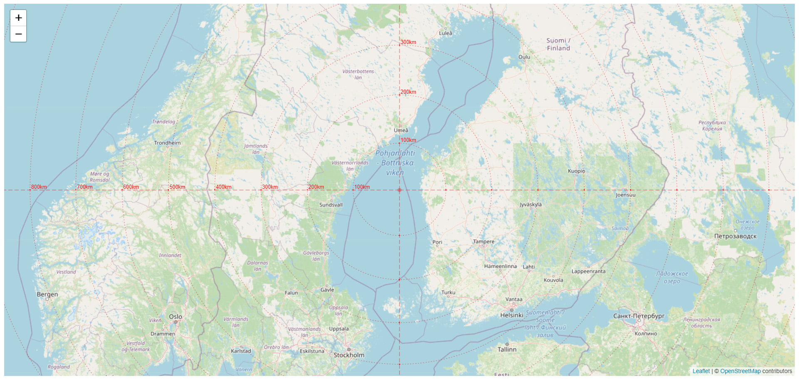

# LeafletEquidistant

This is a plugin for Leaflet that gives a visual representation of distances from the center of the map viewport.

The same distance on some projections (eg Mercator EPSG: 3857) at high latitudes and closer to the equator will differ visually.

[DEMO](https://artsur.github.io/LeafletEquidistant/src/)

[](https://artsur.github.io/LeafletEquidistant/src/)


# Usage

```$js
    const options = {
        centerDot: false,
        distanceUnits: 'nm',
        labelUnits: 'nm',
        ......
    };
    let map = L.map('map').setView([60, 30], 4);
    L.tileLayer('https://{s}.tile.openstreetmap.org/{z}/{x}/{y}.png', {attribution: '&copy; <a href="https://www.openstreetmap.org/copyright">OpenStreetMap</a> contributors'}).addTo(map);
    L.leafletEquidistant(options).addTo(map);
```


# Options

| Option | Type | Default | Description |
|--------|------|-----|--------------------------|
| centerDot | boolean | true | Is show dot in center |
| centerLines | boolean | true | Is show vertical and horizontal lines passing through the center of the map |
| labels | boolean | true | Is show distance labels |
| distanceUnits | string | km | What units are used to measure distance? Can be: 'km', 'mi', 'nm', 'm' |
| labelUnits | string | km | What will be shown in labels after number |
| labelsColor | string | #f00 | Color of labels |
| labelsFont | string | 10px sans-serif | Font parameters for labels |
| centerDotColor | string | #d00 | Color of center dot |
| centerDotSize | number | 4 | Size of center dot in pixels |
| centerDotOpacity | number | 0.3 | Opacity of center dot |
| centerLinesColor | string | #d00 | Color of center lines |
| centerLinesWidth | number | 0.7 | Width of center lines |
| centerLinesOpacity | number | 0.7 | Opacity of center lines |
| centerLinesDashArray | array of numbers | [8, 4] | Pattern of dashes and gaps used to paint center lines  |
| centerLinesColor | string | #d00 | Color of center lines |
| distanceLinesColor | string | #d00 | Color of equidistant lines |
| distanceLinesWidth | number | 0.6 | Width of equidistant lines |
| distanceLinesOpacity | number | 0.6 | Opacity of equidistant lines |
| distanceLinesDashArray | array of numbers | [2, 3] | Pattern of dashes and gaps used to paint equidistant lines |
| updateThrottleMs | number | 10 | Time in milliseconds for throttling move map events  |
| rangeSet | array of objects | see example | A set of parameters for determining the distance grid at different map zooms |

### Example of rangeSet

```$js
    [
          {minZoom: 1, maxZoom: 2, distance: 5000},
          {minZoom: 3, maxZoom: 3, distance: 1000},
          {minZoom: 4, maxZoom: 4, distance: 500},
          {minZoom: 5, maxZoom: 5, distance: 300},
          {minZoom: 6, maxZoom: 6, distance: 100},
          {minZoom: 7, maxZoom: 7, distance: 50},
          {minZoom: 8, maxZoom: 8, distance: 30},
          {minZoom: 9, maxZoom: 9, distance: 10},
          {minZoom: 10, maxZoom: 10, distance: 5},
          {minZoom: 11, maxZoom: 11, distance: 3},
          {minZoom: 12, maxZoom: 12, distance: 2},
          {minZoom: 13, maxZoom: 13, distance: 1},
          {minZoom: 14, maxZoom: 14, distance: 0.5},
          {minZoom: 15, maxZoom: 15, distance: 0.2},
          {minZoom: 16, maxZoom: 16, distance: 0.1},
          {minZoom: 17, maxZoom: 17, distance: 0.05},
          {minZoom: 18, maxZoom: 18, distance: 0.02},
          {minZoom: 19, maxZoom: 22, distance: 0.01},
    ]
```